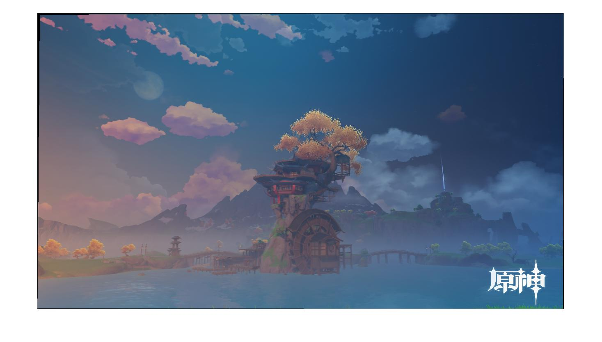
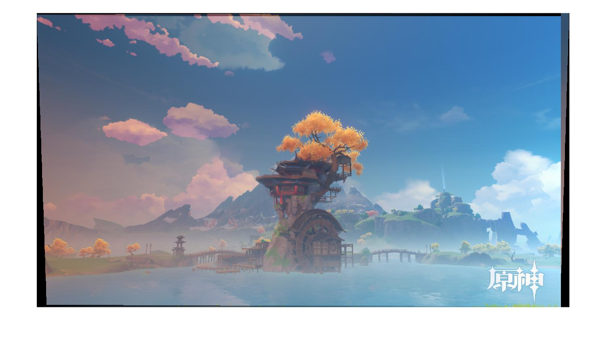
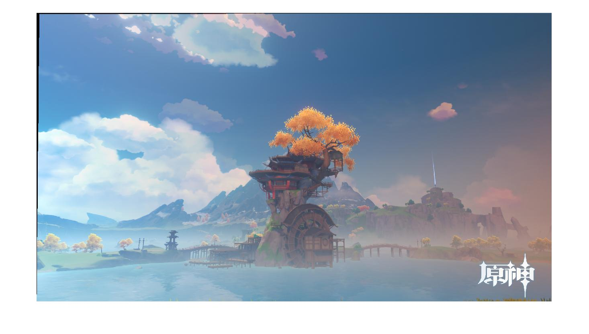
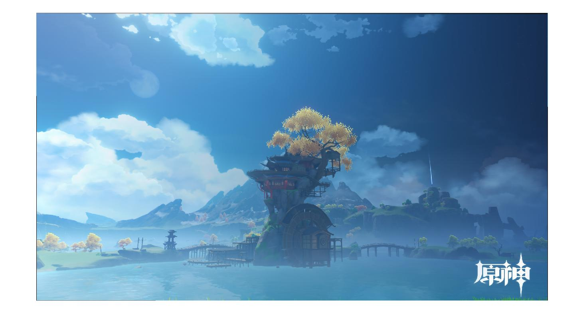
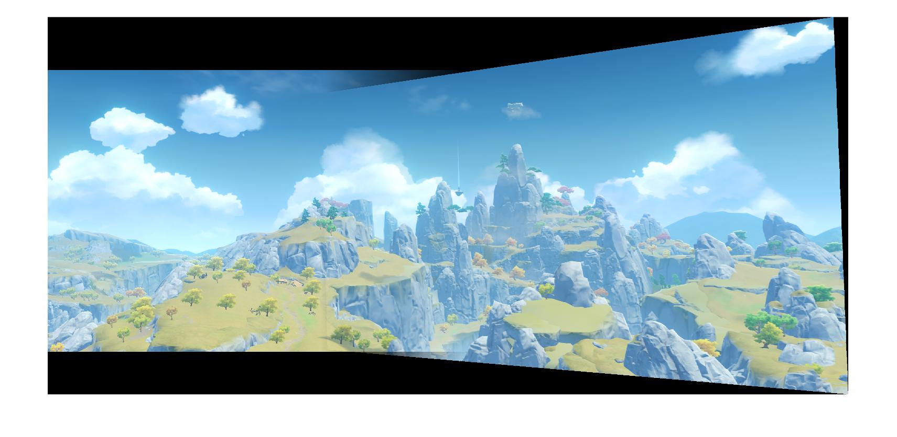
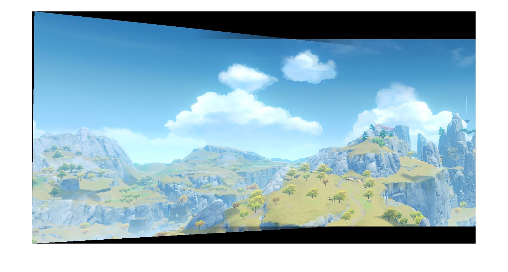

# 基于图像拼接技术实现 A look into the Past

成员及分工

+ 张啸天 PB18000391
  + 文献阅读 + 代码调试
+ 池子韬 PB18051145
  + 素材采集 + 实验报告撰写

### 问题描述

+ 第一类需求：混合同一场景不同时段的照片。
+ 第二类需求：将同一场景的两张局部照片进行拼接。

### 原理分析

+ 
+ 

### 代码实现

### 效果展示

为了同时获得满足开头提到的两类需求的素材，且考虑到取景的困难程度和图像的稳定性，我们选择游戏《原神》中的场景进行拍摄，整理分出两类输入图像集。

set1分别对三个时间段的望舒客栈进行取景：白天、黄昏和黑夜。以下为这三张图像两两混合后的结果。

<table>
    <tr>
        <td >
Figure 1
</td>
    </tr>
</table>
黄昏-黑夜
<table>
    <tr>
        <td >
Figure 2
</td>
    </tr>
</table>
黄昏-白天
<table>
    <tr>
        <td >
Figure 3
</td>
    </tr>
</table>
白天-黄昏
<table>
    <tr>
        <td >
Figure 4
</td>
    </tr>
</table>
白天-黑夜

set2为在璃月某地进行环绕拍摄取景。以下为几组素材拼接后的结果。

<table>
    <tr>
        <td >
Figure 5
</td>
    </tr>
</table>
1-2
<table>
    <tr>
        <td >
Figure 6
</td>
    </tr>
</table>
2-3

### 工程结构

|-- project

​		|-- ada_nonmax_suppression.m

​		|-- blend.m

​		|-- dist2.m

​		|-- getFeatureDescriptor.m

​		|-- getHomographyMatrix.m

​		|-- getNewSize.m

​		|-- harris.m

​		|-- image_stitching.m

​		|-- ransacfithomography.m

### 运行说明

MATLAB中执行函数"image_stitching(input_A, input_B)"即可.其中input_A和input_B为待合成图像文件名；A为会发生扭曲，B则不需要扭曲。